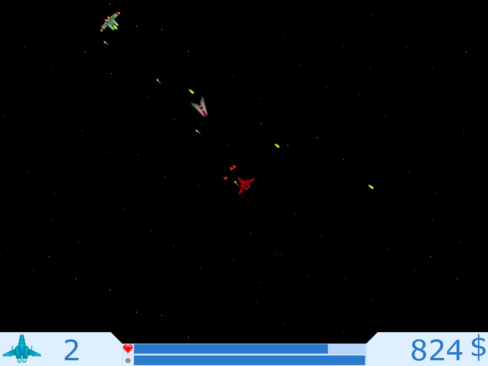
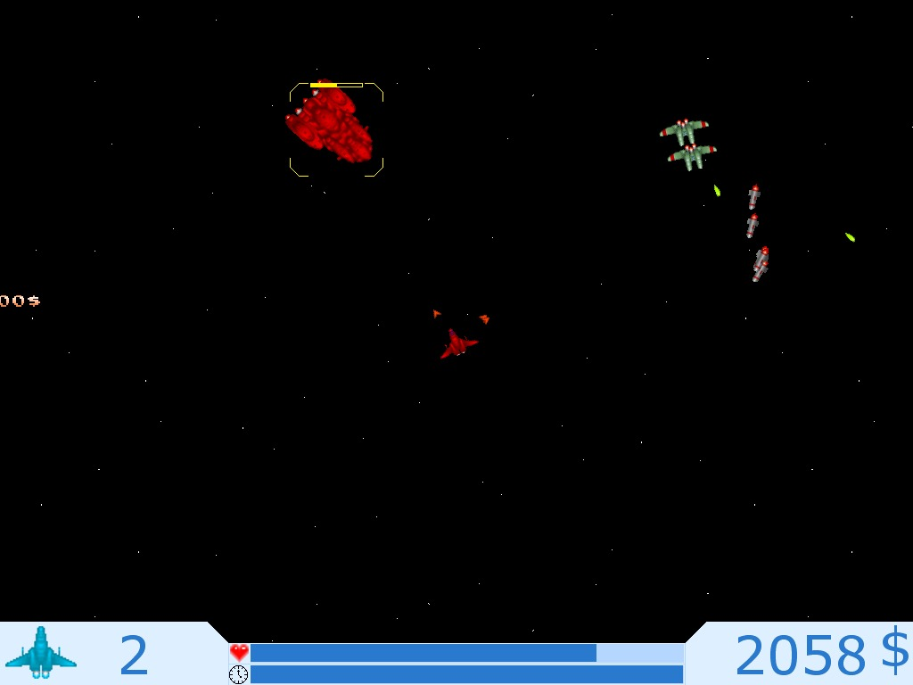
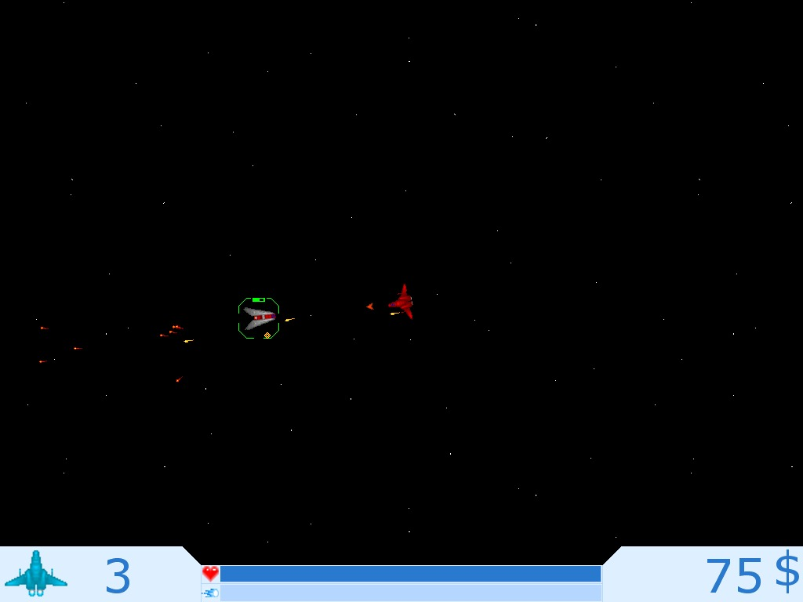
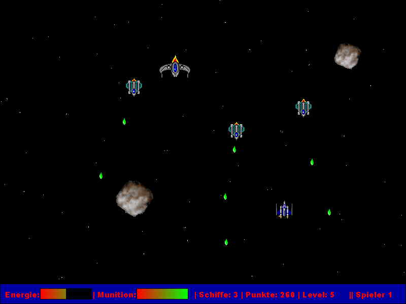
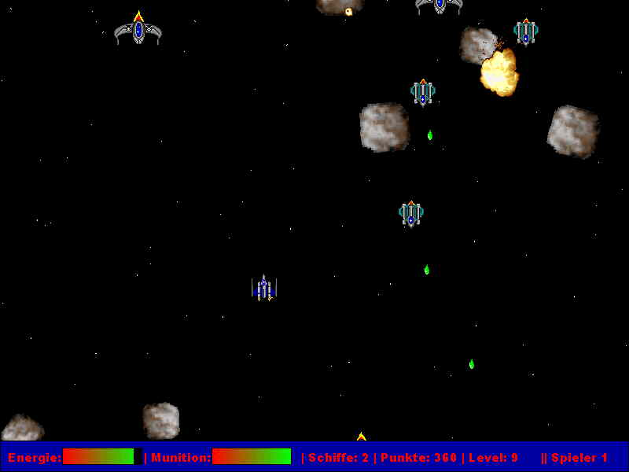
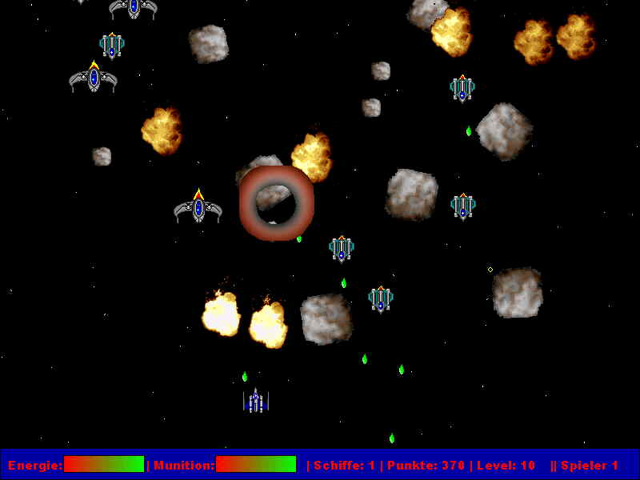
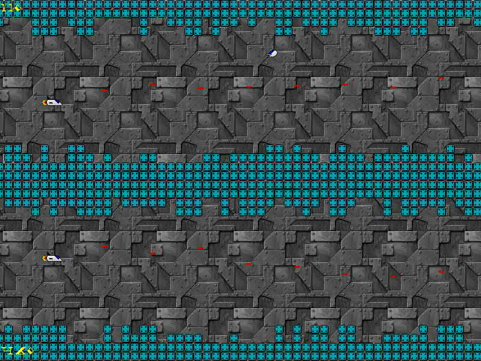

# Freeware—Spiele

Ein paar Freeware-Spiele, die ich vor langer Zeit geschrieben habe.

Nicht-kommerzielle Weitergabe aller Spiele ist gestattet und erwünscht.
Änderungen am Spiel dürfen nicht vorgenommen werden.

## (Not) Just another Space Shooter

Auf den ersten Blick handelt es sich um einen normalen retro Space Shooter bei
dem es soviele Punkte wie möglich zu holen gilt. Doch die geniale Maussteurung
verleiht diesem Shooter mit Asteroids-ähnlicher Physik einen hohen Suchtfaktor.
Verschiedene Zweitwaffen und Power-Ups verleihen dem Spiel zusätzliche Tiefe.

Die Online-Highscores sind aufgrund des Alters des Spiels deaktiviert. Die Top
10 waren:

| Uploader | Name | Punkte | Datum |
|----------|------|--------|-------|
| Ufo |Claus |4195225 |28.03.2007|
| Hertrampf |Torsten |1340200 |02.07.2008|
| Nicki |_Nicki_ !!! |1063550 |14.07.2005|
| Delphinius |Torsten |1030350 |28.03.2008|
| Delphinius |Torsten |631050 |28.03.2008|
| Hertrampf |Torsten |580975 |02.07.2008|
| patrickulrich |Patrick |555600 |22.06.2005|
| Delphinius |Torsten |552225 |28.03.2008|
| Delphinius |Torsten |502250 |28.03.2008|
| Ufo |Claus |493100 |28.03.2007|

## SpaceBattle

SpaceBattle ist ein Vertical-Scrolling-Shooter, der sich zu zweit oder alleine
spielen lässt. Ziel ist es möglichst viele Punkte zu erhalten. Dies Spiel hat
den GameStar Leserdemo-Wettbewerb 7/03 gewonnen.

## Omega 3

Omega3 ist ein horizontal scrollender Shooter. Spannend wird das Spiel unter
anderem dadurch, dass es eine Schwerkraft gibt, die ständig ausgeglichen werden
muss. Omega3 lässt sich alleine oder zu zweit spielen. Allerdings darf sich
immer nur der Spieler mit der höheren Punktzahl in die Highscore eintragen!

